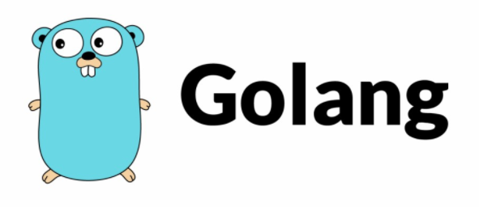

## Golang Cheat Sheet for quick learning
---


&nbsp;
<p style="text-align: center">By the end of this page you will get to know the basic of GoLang
</p>

`Thanks for everyone around the world for sharing information and help other to learn and be part of this awesome family` 

[ Follow Me ](https://www.linkedin.com/in/ahmed-bejaoui-75b57318a)
  
 
#### Golang was designed by Google to work on all platforms [ Linux, Mac, Windows ]

# let's start learning

# Data Types  <br> 
 ```go
  
   var x int = 5
   var v bool = true
   var s string = "sky"
   var f float32  = 1.1

 ```

# Comments

```go

/* 
   multi line comment
*/

// single line comment

```
# Variable  <br> 
 ```go
  
   var x int = 5

   // or
   
   var a , b = 2, 24

   // or

   a := 5
   
   // and like above 
   
   a , b := 2, 24
 
   // but what when we want a constant variable then we use const

   const KEY = "super_key"

   // by this we ensure that the variable will not change
 ```


# Main entry point to golang program and Import & Function

```go

  // before we start coding with go we need to create our main file and import the main package in our code 
  // 1 create file with .go extension

  // 2 let's call it tuto.go
 
  // open the file and type the follow 

  package main // go will execute this package at build 

  import "fmt" // importing package

  // function in go
  func init() {
      fmt.Println("this will run before main()")
  }
  
  // function in go
  func main() {
      fmt.Println("this will run after init()") // this will print on the console
  }


 // to build this file, on the terminal run => go build fileName.go
```
 


# Arithmetic Operatprs
```go
a := 50
z := 5

// Addition
arith := a + z 

// Multiplication
arith := a * z

// Division
arith := a / z

// Subtraction
arith := a - z
```

# If / Else
```go


   a := 7

   if a > 5 {
       fmt.Println("a is greater than")
   } else {
       fmt.Println("a is less than")
   }

```

# Loop
```go

  for i:=0; i < 10; i++ {
      fmt.Println(i)
  }
  // this will print from 0 to 9

```

# Arrays
```go

 var x[3]int // now we have empty array with length of 3

// add value 
x[0] = 3  // index 0 have value of 3
x[1] = 45 // index 1 have value of 45
x[2] = 15 // index 2 have value of 15

fmt.Println(x) // [3, 45, 15]
fmt.Println(len(x)) // length 3
// or 

var x = [3]int{3, 45, 15}
fmt.Println(x) // [3, 45, 15]
fmt.Println(len(x)) // length 3
```

# Struct 
```go 

package main

import "fmt"

// struct
type User struct {
   name string
   age int
}
func main() {
   var user User
    
   user.name = "Elon Musk"
   user.age = 50
   
   fmt.Println( "user.name = ", user.name)
   fmt.Println( "user.age  = ", user.age)
}


```

# Slices
```go 

age = [5]int{23, 18, 78, 56, 81}

var slic1 []int = age[1:4] 
fmt.Println(slic1) // [18, 78, 56]

var slic2 []int = age[:4] 
fmt.Println(slic2) // [23, 18, 78, 56]

```
# Interfaces

```go
// interface declaration
type geometry interface {
    area() float64
}

// instead, types implicitly satisfy an interface if they implement all required methods
func measure(g geometry) {
    fmt.Println(g)
}
```

---

# `Don't forget to reread it again to stick into your mind`
 
